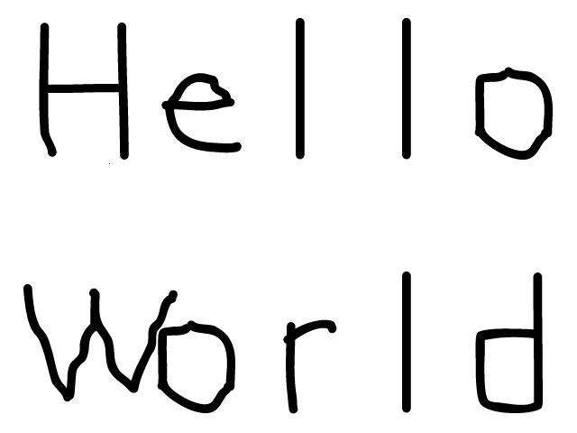

# 01 Getting An Image On The Screen

## 前言

在本章会学习如何将本地的bmp格式文件加载到SDL屏幕，或者说表面（Surface）上。我们将要插入的图片如下所示。

<div align="center" style="">

</div>

从本章开始，代码和原教程的代码会有极大的区别，以防止自己不假思索直接照抄原代码。对了，我发现github的markdown解析不支持html元素，很多格式也出现了错误，所以还请希望享受完整阅读体验的朋友在VSCode上使用Markdown Preview Enhanced（MPE）插件进行阅读，MPE可以说是当下比较强大的markdown阅读器了，支持大量的markdown语法。

## 代码展示

```cpp
#include <SDL.h>
#include <iostream>

struct {
public:
	void Init() {
		SDL_Init(SDL_INIT_VIDEO);
		window = SDL_CreateWindow("Hello", SDL_WINDOWPOS_CENTERED, SDL_WINDOWPOS_CENTERED, width, height, SDL_WINDOW_SHOWN);
	}
	void LoadImage() {
		surface = SDL_GetWindowSurface(window);
		image = SDL_LoadBMP("./hello_world.bmp");
		SDL_BlitSurface(image, NULL, surface, NULL);
		SDL_FreeSurface(image);
		SDL_UpdateWindowSurface(window);
	}
	bool Quit() {
		if (quit == true) {
			SDL_DestroyWindow(window);
			SDL_Quit();
			return true;
		}
		return false;
	}
	void PollEvent() {
		SDL_PollEvent(&event);
		if (event.type == SDL_QUIT) quit = true;
	}
private:
	SDL_Window* window;
	SDL_Surface* image, * surface;
	SDL_Event event;
	bool quit = false;
	const int width = 800, height = 600;
} SDL_Struct;


int main(int argc, char* argv[]) {
	SDL_Struct.Init();
	SDL_Struct.LoadImage();
	while (!SDL_Struct.Quit()) {
		SDL_Struct.PollEvent();
	}
	return 0;
}
```

## 代码讲解

本代码较上一章的代码，除了结构变化外仅仅增添了读取和显示图片的代码。在这里本人为了方便管理，将SDL需要使用的变量和操作统一扔到 ```SDL_Struct``` 结构体中进行管理。其中 ```PollEvent()``` 和 ```Quit()``` 函数是仿照OpenGL的形式进行更改的，但是在现代图形引擎中，这一方式已经基本被淘汰，未来我们会改进这一方式。

## 函数讲解

### 目录

[SDL_LoadBMP](#sdl_loadbmp)
[SDL_BlitSurface](#sdl_blitsurface)
[SDL_FreeSurface](#sdl_freesurface)

### SDL_LoadBMP

<font color=orange>函数原型</font>

```cpp
SDL_Surface* SDL_LoadBMP(const char* file);
```

<font color=orange>描述</font>

从指定的BMP文件中加载图像数据，并将其存储在一个新的 ```SDL_Surface``` 结构中。此函数会自动管理图像的格式和字节顺序，以便SDL能够直接使用加载的图像数据进行渲染。

<font color=orange>输入</font>

```file``` : 指向 BMP 文件路径的字符串。这个路径可以是绝对路径或相对于程序的当前工作目录。

<font color=orange>输出</font>

成功时：返回一个指向 ```SDL_Surface``` 结构的指针，该结构包含加载的BMP图像数据。
失败时：返回 ```NULL``` ，可以使用 ```SDL_GetError()``` 来获取具体的错误信息。

### SDL_BlitSurface

<font color=orange>函数原型</font>

```cpp
int SDL_BlitSurface(SDL_Surface* src, const SDL_Rect* srcrect, SDL_Surface* dst, SDL_Rect* dstrect);
```

<font color=orange>描述</font>

将源表面的指定矩形区域（或整个表面）复制到目标表面的指定位置。它支持处理不同尺寸的图像区域，适合用于多种2D渲染场景。

<font color=orange>输入</font>

```src``` ：源SDL_Surface，即要复制的图像表面。
```srcrect``` ：指定源表面中的矩形区域，该区域将被复制。如果为 NULL，则会复制整个源表面。
```dst``` ：目标SDL_Surface，即要将内容复制到的表面。
```dstrect``` ：指定目标表面上的矩形区域。如果为NULL，则将图像复制到目标表面的左上角。如果指定了位置，则图像会被复制到此位置。

<font color=orange>输出</font>

成功时：返回0。
失败时：返回-1，并且可以使用 ```SDL_GetError()``` 查看错误信息。

### SDL_FreeSurface

<font color=orange>函数原型</font>

```cpp
void SDL_FreeSurface(SDL_Surface* surface);
```

<font color=orange>描述</font>

用于释放一个 ```SDL_Surface``` 结构所分配的内存，包括该表面内部的像素数据。此函数应在表面不再被使用时调用，以确保程序的内存被正确释放。

<font color=orange>输入</font>

```surface``` ：指向要释放的 ```SDL_Surface``` 结构的指针。如果传入 ```NULL``` ，该函数将不执行任何操作。

<font color=orange>输出</font>

此函数没有返回值。